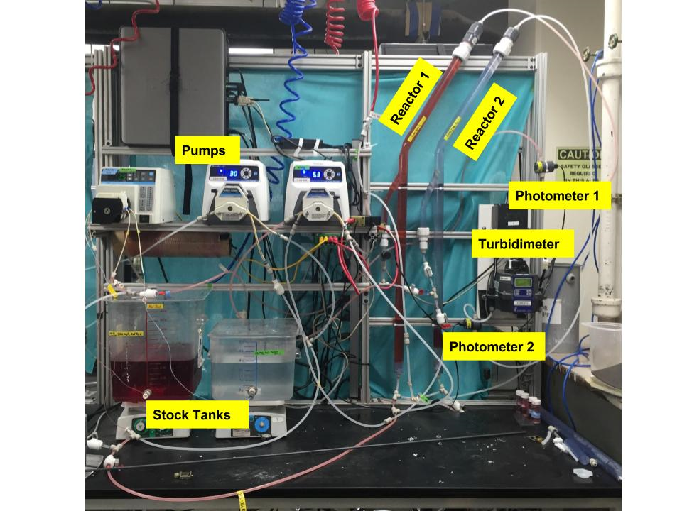
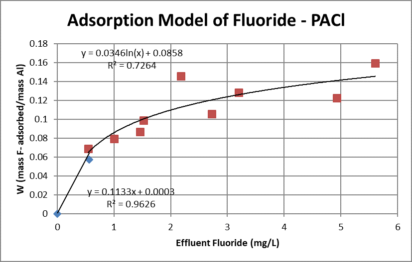
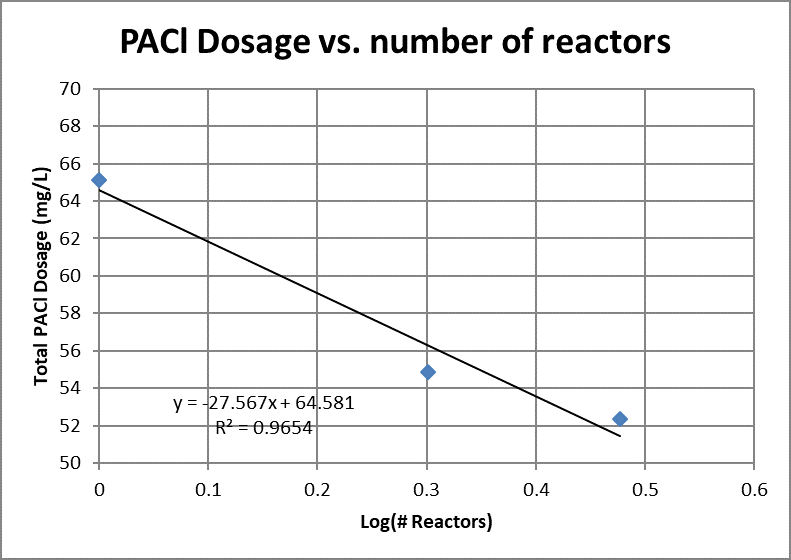
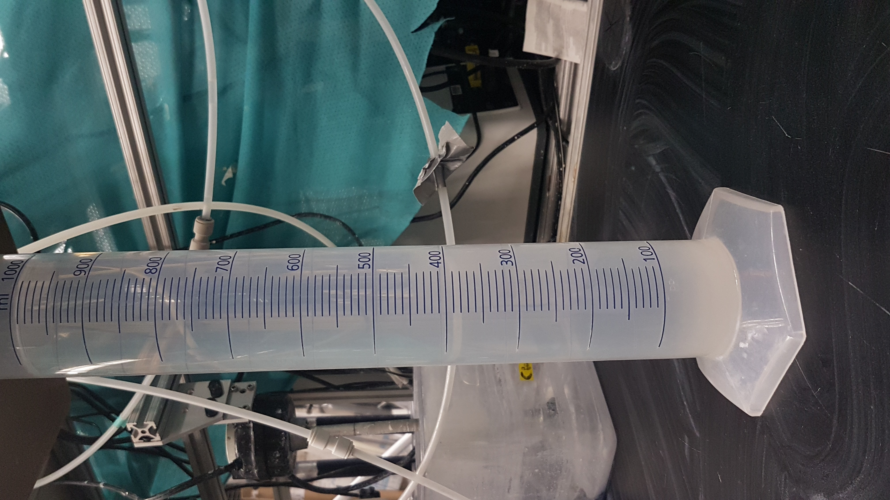
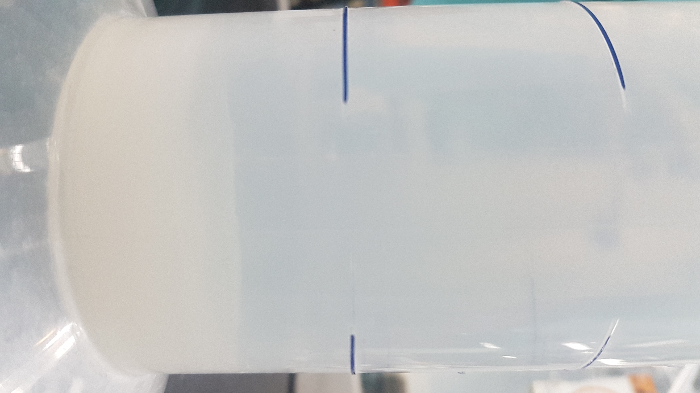

# Waste Stream Management for Drinking Water Treatment
### Team Atlantis: Azhir Barodawala, Congyue (Vicky) Wu and Mike Zarecor


## Introduction

Water - the essence of life, is a resource that we have assumed to be in abundant quantities as a free gift of nature. With the oceans accounting for 97% of all the water present on our planet, the amount of freshwater accessible in the form of surface water is only 1.2% while groundwater accounts for 30% of the remainder 1. Over the past few decades with the increase in industrialization, urbanization and ever-growing population has led to the degradation of the few freshwater sources we have available to us. Groundwater as well as surface water is subject to excessive contamination by dumping of untreated waste from industries into rivers & lakes, untreated sewage and surface runoff of pesticides from farmlands to name a few.  

Living up to its name of being called a Universal Solvent, Water gets easily contaminated due to a wide variety of impurities. These impurities are Dissolved Solids which can be simply defined as any minerals, salts, metals, anions or cations dissolved in water. These Total Dissolved Solids (TDS) mainly comprise of inorganic salts of calcium, magnesium, sodium, potassium etc. as well as a small amount of Dissolved Organic Matter (DOM). The sources of DOM can be pharmaceuticals, fragrances, detergents, pesticides and even products of incomplete combustion that are incompletely degraded and have entered the aquatic environment 2. Presence of various hazardous contaminants like Fluoride, Arsenic, nitrates and sulfates not only makes the water unfit for consumption but also for irrigation and industrial needs 2. There is thus a focus to understand the underlying mechanism for the removal of the inorganic and organic matter present in the water.

Fluoride is a well known contaminant present in groundwater sources. While harmless in small amounts, excessive consumption of fluoride present in water can lead to dental as well as skeletal fluorosis. The World Health Organisation (WHO) limits the fluoride concentration to 1.5 mg/L in drinking and cooking water 3. It is important to note that while there are multiple methods for defluoridation, no single treatment technique can be applied to every process. What may be applicable to one community may not be applicable to another, hence careful consideration has to be taken to design the most sustainable defluoridation technique. 
The Nalgonda Technique developed at National Environmental Engineering Research Institute (NEERI) in India is one of the most popular methods used in defluoridation. This method uses Aluminium Sulfate (Al2(SO4)3.18H2O) in a coagulation- flocculation sedimentation set-up. However, the efficiency of this process is only about 70% and large doses of aluminium sulfate causes sludge disposal problems. 


In accordance with AguaClara’s mission to create affordable, reliable, and sustainable water treatment solutions, the goal of the subteam is to create such a solution for groundwater with excessive fluoride concentrations. Instead of Aluminium Sulfate, Polyaluminium Chloride (PACl) is used as the coagulant to which the fluoride can adsorb and precipitate with. 
The goals of the current AguaClara flocculator team is to understand the mechanism of  the capture of fluoride particles and testing a two-stage reactor  (coagulant-flocculation-sedimentation) to get rid of more dissolved constituents with lesser overall amount of PACl used.

The objective of this project is to study the amount of waste that is generated during the removal of the fluoride due to the PACl. Based on the amount of waste in floc hopper in the lab scale, the total amount of waste that has to be handled in a full scale plant has to be dealt with. This is essential for the continued sustainable mission of AguaClara plants. 


## Dissolved Constituent Removal Literature Review

While AguaClara is currently focused on the removal of fluoride from drinking water, there are many other harmful dissolved contaminants present in water supplies. Since coagulation, flocculation and sedimentation is the most common treatment train used worldwide, it is worthwhile to consider how effective these processes are at removing dissolved constituents.

TP Ahammed Shabeer et. al. conducted research on the effectiveness of alum and PACl as coagulents for removing dissolved pesticides. The results of this study are shown below in figure 1.

<h3 align="center">Figure 1: Removal of pesticides using alum and PACL. </h3>

None of the pesticides were efficiently removed using the standard treatment techniques, with no removal efficieny exceeding 50%. It was found that increased clay concentrations allowed for higher removal efficiencies, but having a required clay concentration is not practicle for AguaClara's purposes. Multi stage treatment similar to the AguaClara fluoride removal process may be viable.

N. Vieno et. al. studied the removal of pesticides via coagulation, sedimentation, and flocculation. They found that many pharmecuticals are not removed using this process. Figure 2 summarizes their results. 

<h3 align="center">Figure 2: Remaining concentration of pharmaceuticals after treatment using aluminum or iron coagulents. IBU= ibuprofen, BZF=bezafibrate, DIC= diclofenac, CBZ= carbamazepine, SMZ= sulfamethoxazole. Me= the amount of metal (Fe or Al)added in water. </h3>

The results of these studies suggest that coagulation, flocculation and sedimentation are not a viable solution to all dissolved species. While the process may be effective for certain constiuents, other processes such as filtration and advanced oxidation processes are more pertinent. Due to this, the AguaClara Fluoride removal process can not be applied to other dissolved species without first testing the process with the specific contaminant.

## Nalgonda Technique 


<h3 align="center">Figure 3: 2-Bucket POU Nalgonda Method for fluoride removal </h3>

The Nalgonda Technique is a batch fluoride removal process that uses aluminium sulphate (alum) and lime to treat the contaminated water. This method was developed by the National Environmental Engineering Research Institute in India in 1975 due to concerns of fluorosis which is still at large in many states in India. 
The amount of alum used as a coagulant for fluoride removal is much higher compared to general water treatment. Lime (Calcium Hydroxide) is added to maintain a neutral pH and hasten the settling process. 
A home or POU set up of this method consists of two 20 litre buckets. Alum and lime are added simultaneously in the first raw water bucket and is stirred vigorously for about 1-2 minutes and then stirred slowly which allows flocs to form. The bucket is left for settling for about an hour and then the water is drained via a tap to the second bucket passing through a cloth filter.
Though this method provides a simple, low cost POU process to remove fluoride, the process has some inherent limitations. These are listed as follows - 
1. Large amounts of alum are required to remove fluoride. 
2. It may not be a universally cheap method since the materials are not readily available everywhere.
3. pH of water is difficult to regulate using lime. 
4. The Nalgonda technique cannot treat fluoride concentrations higher than 10.0 mg/L 
5. Large amounts of sludge created by this method create a disposal issue since it contains high amounts of fluoride. 
6. Requires a high amount of labor and diligence to monitor the process. 
7. Treatment efficiency is limited to about 70% only. 

Overall, the Nalgonda Technique, though extremely useful in some applications cannot be scaled for large populations. Further, large amounts of sludge generated without proper treatment techniques creates more problems than solutions. Hence it is essential to develop a more sustainable fluoride removal process. 

## AguaClara Fluoride Removal Process

The AguaClara fluroide removal team has proposed and tested a two reactor process. Figures 4 and 5 show the reactor setup. 


<h3 align="center">Figure 4: Two stage fluoride removal process diagram. </h3>


<h3 align="center">Figure 5: Bench scale reactor setup.</h3>

This reactor functions as described below:

1. Fluoride first enters flocculator 1 where flocs are created; PACl is added to the influent.
2. Some flocs settle out in sed tank 1.
3. Overflow of sed tank 1 goes to flocculator 2 where another floc blanket is generated; another dose of PACl is added before the flocculator 2.
4. Flocs from the floc weir of sed tank 1 & 2 are sent to waste while the final effluent comes out at the top of the second sed tank. 

Utilizing two reactors in series produces lower effluent concentrations of fluoride (Langmuir isotherm is observed) and uses PACl more efficiently than a single reactor. Figure 6 shows the isotherm developed by the team. 
 
 
<h3 align="center">Figure 6: Isotherm descirbing fluoride adsorption to PACL.</h3>

This isotherm allows the prediction of coagulent dosages as a function of fluoride concentration and the number of reactors used inline. Figure 7 shows the expected change in required coagulent dose as the number of reactors increases.


<h3 align="center">Figure 7: PACL dosages relative to the number of reactors used inline.</h3>

An important consideration for this project is waste stream management. The waste stream generated during the two-stage coagulation flocculation sedimentation process carries flocs that contain aluminum and fluoride. A viable way to deal with this waste must be developed before scale up can be considered. 

## Case Study and Experiment 

To get a better understanding of the amount of sludge produced from the fluoride reemoval process, we performed an experiment to observe the amount of sludge that would be generated on a small scale. However, though this experiment was performed without fluoride in the water, the sludge volume was estimated based on the settled PACl coagulant in the waste stream. 
The experimental conditions were as follows - 
1. plant flow rate = 0.5 ml/s
2. coagulant dose (PACl) = 25 mg/L
3. coagulant dilution factor in stock tank = 3 ml/L

The waste stream was collected from the floc hopper (tube settler). 1 litre of the sample was collected in  4 hours. After waiting for the sludge to settle, the resulting solution looked like this. Around 30 ml of sludge was formed at the base of the measuring cylinder after letting it settle for a day.  

 

<h3 align="center">Figure 8: Settled sludge   </h3>


<h3 align="center">Figure 9: Close up of Settled sludge   </h3>

### Lab Scale Calculations


```python
from aide_design.play import *
```


```python
#Experiment set up and measured values
Q_lab = 0.5*(u.ml/u.s)
PAC_dose_lab = 25*(u.mg/u.L)
T_lab = 4*u.hr
V_waste_sludge_lab = 30*u.ml
V_waste_total_lab = 1*u.L

#Calculated Values
V_total_lab = (Q_lab * T_lab).to(u.L)
V_effluent_lab = V_total_lab - V_waste_total_lab
V_waste_water_lab = V_waste_total_lab - V_waste_sludge_lab
M_PAC_lab = (PAC_dose_lab * (Q_lab * T_lab).to(u.L)).to(u.g)
C_PAC_sludge_lab = M_PAC_lab / V_waste_sludge_lab.to(u.L)

#Plant Design Parameter Outputs
Ratio_V_effluent = V_effluent_lab / V_total_lab
Ratio_V_waste_water = V_waste_water_lab / V_total_lab
C_sludge_PAC = C_PAC_sludge_lab

print('The ratio of effluent volume to total volume is' ,Ratio_V_effluent)
print('The ratio of waste water volume(recycle) to total volume is' ,Ratio_V_waste_water)
print('The PAC concentration of the sludge' ,C_sludge_PAC)
```

    The ratio of effluent volume to total volume is 0.8611 dimensionless
    The ratio of waste water volume(recycle) to total volume is 0.1347 dimensionless
    The PAC concentration of the sludge 6 gram / liter
    

### 1 L/s Plant Waste Stream

The following assumptions were made in this design:
1. Waste stream flowrate is a function of plant flowrate.
2. Concentration of Aluminum in sludge is a constant at all PAC doses.
3. Fluoride does not add a significant volume to sludge.
4. Intermediate fluordie concentration is set (this could be adjusted by implementing goalseek, but we did not have time)
5. Flowrate of sludge is insignificant to flow calculations


```python
#Plant Design Inputs
Q_plant = 1*(u.L/u.s)
C_groundwater_F = .01*(u.g/u.L)
C_effluent1_F = .00305*(u.g/u.L)# This and C_in could be calculated to minimize PAC from the other inputs we just used fluorides excel iteratively
C_out_F = .001*(u.g/u.L)
Ratio_V_effluent
Ratio_V_waste_water
C_sludge_PAC
UnitFixer = 1000*(u.L/u.g)#np.log needs a dimmensionless input, but .to(u.dimmensionless) would not work since the concnentration isnt dimmensionless

#Plant Flowrates
Q_effluent1 = Q_plant * Ratio_V_effluent
Q_recycle1 = Q_plant * Ratio_V_waste_water
Q_out = Q_effluent1 * Ratio_V_effluent
Q_recycle2 = Q_effluent1 * Ratio_V_waste_water
Q_GW = Q_plant - Q_recycle1 - Q_recycle2

#Plant Influent Concentration
C_in_F = (Q_recycle1 * C_effluent1_F + Q_recycle2 * C_out_F + 
          (Q_plant - Q_recycle1 - Q_recycle2)* C_groundwater_F) / Q_plant

#PAC doses
PAC_dose1 = (C_in_F - C_effluent1_F)/(.0346 * np.log(C_effluent1_F * UnitFixer) + .0858)
PAC_dose2 = (C_effluent1_F - C_out_F)/(.0346 * np.log(C_out_F  * UnitFixer) + .0858)

#Flowrate of sludge
Q_sludge1 = PAC_dose1 * Q_plant / C_sludge_PAC
Q_sludge2 = PAC_dose2 * Q_out / C_sludge_PAC
Q_sludgeT = Q_sludge1 + Q_sludge2

#Mass flow of fluoride removed
MFlow_sludge_F = (Q_plant * C_in_F) - ((Q_recycle1 + Q_effluent1) * C_effluent1_F)
MFlow_sludge_F2 = (Q_effluent1 * C_effluent1_F) - ((Q_recycle2 + Q_out) * C_out_F)
MFlow_sludge_FT = MFlow_sludge_F + MFlow_sludge_F2

#Fluoride concentration of sludge
C_Sludge_FT = MFlow_sludge_FT / Q_sludgeT

print('The effluent flow rate is',Q_out)
print('The fluoride concentration of the effluent is',C_out_F)
print('The sludge flow rate is',Q_sludgeT)
print('The aluminum concentration of the sludge is',C_sludge_PAC)
print('The fluoride concentration of the sludge is',C_Sludge_FT)
```

    The effluent flow rate is 0.7415 liter / second
    The fluoride concentration of the effluent is 0.001 gram / liter
    The sludge flow rate is 0.009612 liter / second
    The aluminum concentration of the sludge is 6 gram / liter
    The fluoride concentration of the sludge is 0.7024 gram / liter
    

## Residual Treatment Techniques Literature Review

Drinking water treatment procedures usually end up with a considerable amount of waste due to the removal of solids that are present in the water. The waste can be organic or inorganic compounds in the solid, liquid or gaseous state depending on the treatment technique used and the raw water quality. Each Water Treatment plant should take into consideration the effective handling of these wastes in compliance with the norms of that specific region. 

In order to treat the waste generated by the plant, it is first important to characterise the form, quality and quantity of the sludge. Secondly, the regulations that must be followed in the particular area where the Water Treatment Plant (WTP) is located have to be determined in order to identify feasible disposable options. Finally, the economics of the entire operation of waste treatment is very crucial and can arise in the final decision of whether to construct the WTP or not. 

The residuals obtained from the water treatment process can be of different types as summarised below. 
1. Sludges - This residual contains suspended solids which are made up by the initial solids present in the source water and any chemicals that were added for the treatment process. Pre-sedimentation, coagulation, filter backwashing operations, lime softening, iron and manganese removal, and slow sand filtration all produce sludge.
2. Concentrates (brines) from ion exchange resins and salt water conversions, membrane reject water and spent backwash. 
3. Ion Exchange Resins, spent granular activated carbon or any other filter media which has to be replaced. 
4. Air Emissions. 

Overall, the chemical characteristics and contaminant concentration levels in these residual waste streams often impose the ultimate disposal options. Furthermore, it is reasonable to expect that as drinking water quality is increasingly regulated, higher removal efficiencies of more contaminants will be required. To achieve these higher efficiencies, WTPs will need to use more sophisticated and sustainable treatment technologies. 

The AguaClara process that is based on Coagulation-Sedimentation-Filtration, has to deal mainly with the sludge that is collected in the floc hopper of the sedimentation tank. The sludge consists of  PACl, water and fluoride. 
Decreasing the volume of water and increasing the solid content is principal objective of the solid removal system. This results in decreasing the landfill volume required and reduces the overall cost. There are several solid removal techniques that can be used  by WTPs to treat the residual solids. A few of them are listed as follows. 

1. Thickening - Solids separation by physical means without the significant application of mechanical devices. Sedimentation (gravity settling) and dissolved air flotation are examples of drinking water residuals thickening technologies.
2. Mechanical Dewatering -  Solids separation by mechanical means. Pressure filtration and centrifugation are examples of mechanical dewatering technologies.
3. Non-Mechanical Dewatering -  Solids concentration by evaporation of the water. Storage ponds, lagoons, and drying beds are examples of non-mechanical dewatering.
4. Thermal Treatment - Solids concentration by evaporation of the water using mechanical drying processes.

Once a considerable amount of the solids have been separated from the water, it can then be disposed off in a reasonable manner that is consistent with the given regulations of the area. The disposal practices reduce the surface water discharge as well as the load on Publicly Owned Treatment Works (POTWs). This can help WTPs eventually becoming zero discharge facilities. 
A few options to dispose off the sludge are as follows

1. Land Application of Residuals - The application of residuals onto land depends on the crop being grown, chemistry of the soil, and sludge properties. Land application typically occurs with lime softening sludge, and to some extent coagulation sludge (e.g., alum sludge). Lime softening sludge can be used on farm land in place of commercial products to neutralize soil pH. Alum sludge does not benefit the soil and is used only for filler material. The ideal land application of WTP residuals occurs on non-food chain crops, mine reclamation areas, and forests. 
    Disadvantages of land application might exist depending on the properties of the residuals. For example, land application can result in increased concentration of metals in the soil (and possibly grounwater). Further, groundwater protection must also be addressed. WTPs can transport the residuals for off site land application via tanker or truck. Residuals managed by land application typically contain less than 15 percent solids. There must be sufficient liquid in the residuals to form pumpable slurry. Land application methods include spraying from trucks or a sprinkler system, injecting into the subsurface, or discharging the slurry onto a selected field. 

2. Solid Residuals discharge to Landfills - Landfills for residuals can be either monofills or municipal sanitary landfills (which contain many different kinds of waste). Disposal fees are usually based on weight of material presented for disposal and vary with different locations around the country. EPA regulates landfill disposal under the Resource Conservation and Recovery Act (RCRA)

Additionally, in order to reduce the overall environmental impact, it is important to consider the management of the water that has now been removed from the solids and its handling. Some current techniques that can be used are recycling of water to the beginning of the treatment system, evaporation and direct discharge to surface water which is a very common technique that’s being used by most plants today. Some of the best practices that have been used are listed as follows - 

1. Limiting discharge flow rate -  Rather than allowing batch discharges, permits can require WTPs to slowly discharge residuals into the receiving stream. Slowly discharging the residuals allows dilution in the receiving stream and minimizes the impacts of the pollutant discharge.

2. Prohibiting discharges of solid residuals unless land-based use/disposal options are not feasible and/or WTPs demonstrate discharge does not degrade receiving water quality.

3. Requiring that solids disposal from periodic cleaning of settling basins be land-based to avoid large batch discharges to the receiving stream.

4. Prohibiting discharges of chlorinated backwash (or other waste streams) unless the WTP demonstrates that the receiving water-quality standards can be met at all times.

5. Equalizing the residuals discharge to avoid large batch discharges of pollutants. The WTP collects residuals in a tank, basin, or other device and discharges at a controlled flow rate over time. This practice can be used for filter backwash water (generated at very high flow rates for short

As a whole, there are many well known residual treatment techniques that are currently being used by WTPs. The essence of its implementation lies finally in the economics and regulations in the location of the plant. To continue the tradition of sustainability, it is necessary to factor in the management of residuals. One area worth looking into for AguaClara plants is the possible reuse of the water recovered from the separation of solids. The actual amount of sludge must be determined in the lab scale which would give us a better idea of the removal and separation of the water present in the residual stream. 


## Possible Waste Management Techniques for AguaClara Plant Fluoride Removal

### 1. Waste Reduction

Minimizing the amount of waste generated by a water treatment plant is one of the primary steps towards sustainable water treatment. By reducing the amount of sludge in the first place, operational costs, liability risks and environmental impacts are automatically reduced. A few methods that can be used for waste reduction are - 
1. Optimizing the source water intake to reduce the suspended solids in the treatment plant. 
2. Recycling filter backwash to the head of the filter for reuse. 
3. Optimizing pH to reduce coagulant use. 
4. Optimizing filter media for finished water and residuals
5. Reduce and reuse softening chemicals by monitoring water hardness. 

Though all the above methods are effective, the recovery of coagulant shows promise due to reduction of costs due to less sludge disposal as well as lesser cost for purchasing more coagulant. This could be a potential venture for the AguaClara Team to explore. 

### Coagulant Recovery by Acidification

The general coagulant recovery techniques are acidification, alkanization, ion exchange and membrane separation. From thes listed methods, acid recovery is the most widely used method due to its high efficiency of recovery and low operating cost. 

Though this concept is not novel, the recovery of coagulants has been traditionally limited by the process economics and quality of the coagulant recovered. Usually sludge also contains metals such as manganese, arsenic and zinc. Since acid recovery is not a selective process, there lies the possibility of building up impurities in the water. However, this constraint is linked to the source of raw water. (For a place like Rajasthan, India, the major source of raw water is from aquifers in the ground which contain inorganic compounds such as fluoride, chlorine, sulphates and nitrates which)

On the other hand, recovering aluminium could reduce the demand for fresh coagulants and redue the overall footprint of the water treatment plant. Aluminium concentration in water treatment sludge has been reported to have a range between 15 - 300 g/kg of the sludge with a pH of 5.0 - 8.2 (Makris & O’Connor). Aluminium can have an overall concentration of about 39% in the sludge collected from the water treatment process as well (Abdo et al.).

The traditional approach for acid extraction is by lowering the pH to re-dissolve the aluminium sludge in the water. There is a linear realtionship between the amount of acid added and the aluminium solubility. However, the presence of Natural Organic Matter (NOM) and other contaminants increase the demand for acid. All coagulant recovery technologies require the coagulant metals to be returned to the aqueous phase which accounts for 25% of the operating costs for selecive coagulant recovery. The most common acid used is sulphuric acid due to its low cost compared to hydrochloric acid. In order to recover more coagulant, more acid will be required which will drive up the process cost and also increase NOM solubilization. Optimum pH lies in the range of 2.0 - 4.0 to get a balance between coagulant and contaminant solubility. Adding too much acid would also make neutralization difficult later. 

To calculate the amount of acid required for solubilization, a simple molar balance and can be used to give an estimate. 

M(OH)3 + 1.5 H2SO4 --> 0.5 M2(SO4)3 + 3 H2O

where M is a trivalent metal. 

The process usually requires 1.5 times the molar amount of aluminium hydroxide present in the water. Hence, it would be an interesting area for further reasearch for the AguaClara fluoride team and waste residuals team to determine the optimal pH where Aluminium separates from the fluoride which can then be separated.

The success of this entire process now lies in the efficient metal-contaminant separation in the acidified sludge solution. Essentially, we want to recover only the aluminium while the remaining contaminants can dried and disposed to a landfill. Earlier technologies simply used solid-liquid filtration or sedimentation to remove solids from the recovered coagulant. 
Current technologies employ membranes and adsorbents for efficient separation. 

Membrane separation can be divided into Pressure and Charge based separation techniques. While Pressure based separation faces the biggest challenge of membrane fouling, Charge based separation has resulted in some of the successful coagulant separation.
These technologies are
1. Liquid-Ion Exchange 
2. Ion-Exhchange Resins
3. Donnan Membrane Process
4. Electrodialysis 


### 2. Residual Treatment

### Thickening and Dewatering 

Both processes concentrate solids, but thickening generates a product that still behaves as a liquid, while dewatering produces a cake that behaves as a paste-like or solid material.
Dewatering is almost always preceded by a chemical conditioning process to improve sludge dewaterability. Conditioning is intended to produce chemical alterations of the sludge’s gel structure, which translate into the physical responses to imposed forces during mechanical dewatering.

Further, the liquid stream coming from the dewatering unit should be considered. This is because the pollutant loads and the amount of this stream, often referred as ―reject water, play an important role in WTPs as it should be recycled back to the plant.

Drying 

A drying step is essential if followed by a thermal treatment process, especially in the case of gasification or pyrolysis when the dry solid contents must ideally be greater than 85%. The following table clearly shows that the energy demand related to drying is much higher than gravity or mechanical techniques.


```python
Techniques = ["Thickening", "Dewatering", "Thermal Drying"]
Energy_Demand = ["3.6-36","3600-36000","3600000"]
Dry_Solid_Content_Range = ["<5 - 6%", "<20-25%", "<95%" ]

Energy_reqd = list(zip(Techniques,Energy_Demand,Dry_Solid_Content_Range))

df = pd.DataFrame(data = Energy_reqd, columns = ["Technique","Energy Demand (J/L)", "Dry solid content range"])

df
```


<div>
<style>
    .dataframe thead tr:only-child th {
        text-align: right;
    }

    .dataframe thead th {
        text-align: left;
    }

    .dataframe tbody tr th {
        vertical-align: top;
    }
</style>
<table border="1" class="dataframe">
  <thead>
    <tr style="text-align: right;">
      <th></th>
      <th>Technique</th>
      <th>Energy Demand (J/L)</th>
      <th>Dry solid content range</th>
    </tr>
  </thead>
  <tbody>
    <tr>
      <th>0</th>
      <td>Thickening</td>
      <td>3.6-36</td>
      <td>&lt;5 - 6%</td>
    </tr>
    <tr>
      <th>1</th>
      <td>Dewatering</td>
      <td>3600-36000</td>
      <td>&lt;20-25%</td>
    </tr>
    <tr>
      <th>2</th>
      <td>Thermal Drying</td>
      <td>3600000</td>
      <td>&lt;95%</td>
    </tr>
  </tbody>
</table>
</div>


Ideally, the highest amount of water has to be removed after mechanical dewatering in order to save energy during the drying process.
Following this usual way of thinking, drying and dewatering are seen as two independent steps and are independently improved, with the single objective of reducing water content as much as possible and saving energy. Because these both operations are also the most expensive in the total treatment cost, one could look at improving dewatering and drying as a single and global operation and focus on how to get the best initial drying conditions.


```python
def energy_thickening (L_water): 
    energy_range = (np.linspace(3.6,36,10))*(u.J/u.L)
    E_avg = np.mean(energy_range)
    E = E_avg * L_water
    return E

def energy_dewatering (L_water): 
    energy_range = (np.linspace(3600,36000))*(u.J/u.L)
    E_avg = np.mean(energy_range)
    E = E_avg * L_water
    return E 

def energy_drying (L_water): 
    E = (3.6*10**5)*(u.J/u.L)*L_water
    return E
```

### Solar Evaporation 
Evaporation is commonly used to remove liquids from sludge in wastewater treatment. If an AguaClara treatment system was located in an environment where this method is practical it would be energy efficient and cost effective. We propose using the following model to determine the practicallity at each site. (we will move this into python for final, just didnt have time yet) 


For the separation of water from **Alum-Fluoride combined solids**, we can simulate the process with solar drying for sewage sludge. 


```python
density_air = 1.225 *u.kg/u.m**3
Q_ventilation = 100 *u.m**3/u.m**2/u.hr
R_solar = 400 *u.W/u.m**2
T_air = u.Quantity(15,u.degC)
Q_mixing = 80 *u.m**3/u.m**2/u.hr
DS_initial = 0.3
# values could change when more experiments are conducted

def evaporation_rate_sludge (density_air,Q_ventilation,R_solar,T_air,Q_mixing,DS_initial): 
    density_air1 = (density_air).magnitude
    Q_ventilation1 = (Q_ventilation).magnitude
    R_solar1 = (R_solar).magnitude
    T_air1 = (T_air).magnitude
    Q_mixing1 = (Q_mixing).magnitude
    r_e_sludge = (1.964*10**(-11)*density_air1*Q_ventilation1) * (R_solar1+1100)**2.322 * (T_air1+13)**1.292 * (Q_mixing1+0.0001)**0.013 / Q_ventilation1**0.577 / (DS_initial+0.26)**0.353
    return r_e_sludge *u.kg/u.m**2/u.hr

r_e_sludge = evaporation_rate_sludge (density_air,Q_ventilation,R_solar,T_air,Q_mixing,DS_initial)
#in the example above, use the function to calculate and get r_e_sludge~0.4 mm/h
#(assuming density_sludge=1000 kg/m^3)

m_sludge =  ((Q_sludgeT * (C_Sludge_FT + C_sludge_PAC)).to(u.kg/u.hr))/DS_initial

def A_evaporation (m_sludge,r_e_sludge):
    A_evaporation = m_sludge/r_e_sludge
    return A_evaporation
A=A_evaporation (m_sludge,r_e_sludge)

print('The area required to evaporate the water from the',m_sludge,'sludge would be',A)
```

    The area required to evaporate the water from the 0.7731 kilogram / hour sludge would be 2.008 meter ** 2
    

For the separation of water from **Fluoride residual solids** after the acid recovery of alum, we can simulate the process with solar evaporation for salt making. 


```python
T_max = u.Quantity(25,u.degC)
T_min = u.Quantity(15,u.degC)
T_avg = 0.5*((T_max).magnitude+(T_min).magnitude)
Humidity_max = 0.10
Humidity_min = 0.05
Humidity_avg = 0.5*(Humidity_max+Humidity_min)
p_air = 101.325 *u.kPa
R_net = 30 *u.MJ/u.m**2/u.day
u_2 = 1.35 *u.m/u.s
a_water = 0.9
# a_wter is related with concentration of dissolved salts in water
# different kind of salts have different empirical a_water values

def latent_heat_vaporization (T_avg):
    latent_heat = (2.501-0.002361*T_avg) *u.MJ/u.kg
    return latent_heat

def p_vapor_saturation (a_water,T_avg):
    p_vapor_saturation = 0.6108*a_water*np.exp(17.27*T_avg/(237.3+T_avg))
    return p_vapor_saturation *u.kPa

def p_vapor_water (p_v_sat,Humidity_avg):
    p_vapor_water = p_v_sat/100*Humidity_avg
    return p_vapor_water

def slope (p_v_sat,T_avg):
    p_v_sat1 = (p_v_sat).magnitude
    slope = 4098*p_v_sat1/(237.3+T_avg)**2
    return slope *u.kPa/u.K

def psy_constant (p_air):
    p_air1 = (p_air).magnitude
    psy_constant = 0.000655*p_air1
    return psy_constant *u.kPa/u.K

def u_function (u_2):
    u = (u_2).magnitude
    u_function = 6.43*(1+0.536*u)
    return u_function

latent_heat = latent_heat_vaporization (T_avg)
p_v_sat = p_vapor_saturation (a_water,T_avg)
p_v_w = p_vapor_water (p_v_sat,Humidity_avg)
slope = slope (p_v_sat,T_avg)
psy_constant = psy_constant (p_air)
u_function = u_function (u_2)

def evaporation_rate_salt (latent_heat,slope,psy_constant,R_net,u_function,p_v_sat,p_v_w):
    r_e_salt = slope*R_net/(slope+psy_constant)/1000/latent_heat+psy_constant*u_function*(p_v_sat-p_v_w)/(slope+psy_constant)/1000/latent_heat*1000*u.m/u.day
    return r_e_salt .to(u.kg/u.m**2/u.hr)

r_e_salt = evaporation_rate_salt (latent_heat,slope,psy_constant,R_net,u_function,p_v_sat,p_v_w)
# in the example above, use the functions to calculate and get r_e_salt~0.0004 mm/h
#(assuming density_saltywater=1000 kg/m^3)

```

## Conclusions and Recommendations 

Fluoride is one of the minerals present in water which can have both benefecial and detrimental effects on human health. Hence, maintaining the right amount of fluoride in water is essential for municipal water treatment. More often that not, water treatment plants have to remove excessive fluoride from the influent water due to contamination from pesticides and leaching from rocks. AguaClara currently uses PACl as a coagulant which has a higher fluoride removal efficiency compared to Alum - the conventional coagulant. Additonally, PACl also results in less waste formation compared to Alum as well. 

However, the issue of dealing with waste is still one of the hurdles on the way to being completely sustainable. Waste minimization is the primary step to reduce the overall footprint and volume of sludge that has to be dealt with. Coagulant recovery by acidification has been proven successful in the past with different coagulants and should be explored further in by the Aguaclara team. The main focus of the research should be to identify the optimum pH at which the aluminium solubilizes while leaving the fluoride behind. Based on the experiment we conducted, we realised that the sludge produced is very little compared to the amount of water present. This, essentially clarified water, can be recycled back to the beginning of the plant. 
By recovering the coagulant, the amount of residuals that now have to be dealt with are significantly reduced and can be easily dried off using solar drying beds. 

The goal of reducing the overall environmental impacts of the AguaClara plants is crucial to achieving sustainability. The AguaClara team should begin its investigation with the amount of aluminium they can recover after acidification after defluoridation. They should also evaluate the effect of coagulant recycle on the overall plant performance to finally take a call whether this would be feasible in the long run.  


## Bibliography 

1.    Howard Perlman, U. Where is Earth’s water? USGS Water-Science School. USGS - U.S. Geological Survey Available at: https://water.usgs.gov/edu/earthwherewater.html. (Accessed: 8th November 2017)
2.    Stackelberg, P. E. et al. Efficiency of conventional drinking-water-treatment processes in removal of pharmaceuticals and other organic compounds. Sci. Total Environ. 377, 255–272 (2007).
3.    [No title]. Available at: http://www.who.int/water_sanitation_health/publications/fluoride_drinking_water_full.pdf. (Accessed: 8th November 2017)
4.    Graphs of fluoride removal due to PACl obtained from AguaClara Fluoride team of Fall 2017.
5.    Vieno, N, et. al, Removal of pharmaceuticals in drinking water treatment: effect of chemical coagulation
Environmental Technology, 27 (2006), pp. 183-192 http://iahr.tandfonline.com/doi/abs/10.1080/09593332708618632
6.    Ahammed Shabeer et. al, Simultaneous removal of multiple pesticides from water: Effect of organically modified clays as coagulant aid and adsorbent in coagulation–flocculation process, Environmental Technology, 35 (2014) http://dx.doi.org/10.1080/09593330.2014.914573
7.    Methods for calculating brine evaporation rates during salt production, D. Glen Akridge, 2007
8.    Keeley, J., Jarvis, P., & Judd, S. J. (2014). Coagulant Recovery from Water Treatment Residuals: A Review of Applicable Technologies. Critical Reviews in Environmental Science and Technology, 44(24), 2675–2719. http://doi.org/10.1080/10643389.2013.829766
9.    Ayoub, M., & Abdelfattah, A. (2016). A parametric study of alum recovery from water treatment sludge. Water Science and Technology, 74(2), 516-523. doi:http://dx.doi.org.proxy.library.cornell.edu/10.2166/wst.2016.241
10.   National Drinking Water Clearinghouse 2005. Water Treatment Plant Residuals Management. Water Encyclopedia. 1:411–413.
11.   Seginer I. and Bux M. Prediction of Evaporation Rate in a Solar Dryer for Sewage Sludge, Agricultural Engineering International: the CIGR Ejournal. Vol. VII. (2005).
12.   Kurt M., Aksoy A., Dilek S. F. Evaluation of solar sludge drying alternatives by costs and area requirements. Water Research, 82, 47-57 (2015).
13.   Akridge D. G. Methods for calculating brine evaporation rates during salt production. Journal of Archaeological Science, 35,1453-1462 (2008).
14.   Seginer I., Ioslovich I., Bux M. Optimal Control of Solar Sludge Dryers. Drying Technology, 25:2, 401-415 (2007).
