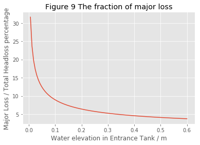
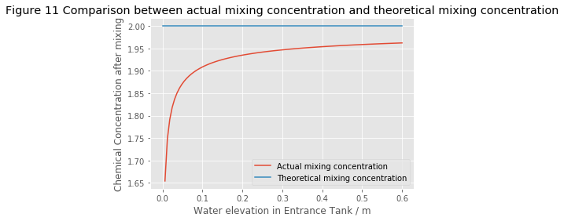
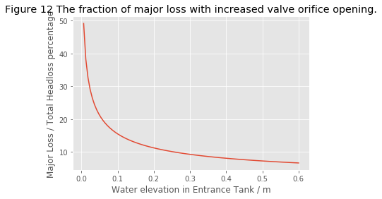

# Chemical Dose Controler (CDC) Simplification
**Team:MIC**

**Team members: Yuhao Du, Simiao Wang, Yingge Wang, Lingzi Xia**

---

## Abbreviation

CDC: chemical dosage controller

Chemical feeding rate: the flow rate of chemical dosage

---

## Introduction

In order to achieve easier operation for operators and better performance for water treatment facilities, we plan to substitute the LFOM and slider part with a single valve, which allows operators to change chemical dosage by adjusting valve opening. In that way, we change the mechanism of CDC from major loss control to minor loss control.

To achieve a minor loss control, we try to make the head loss dominant by expansion through a valve. To reduce the major loss, we’ll replace the long straight and slim dosing tube set with a shorter and larger tube. 

We’ll remove the LFOM and just leave an orifice in the bottom of the flow entrance tank, which allows water level proportional to the square of the flow rate. And the elevation change of the dosing tube is proportional to chemical feeding rate. By setting the lever to be equal-length, we ensure the elevation change in flow tank is the same as the head loss in chemical feeding system, thus we could reach a proportional relationship between the nonlinear tank flow rate and the chemical feeding rate. 

Our main concern would be whether a valve could keep the minor loss dominate. We'll set up equations and do error anaylysis to test our assumptions and build reliability into our system. At last we would compare the new CDC to the old CDC.

---

## 2-D layout of our system


## <center>Figure 1 2-D layout of our design with zero entrance tank flow rate</center>

## <center>Figure 2 2-D layout of our design with certain entrance tank flow rate</center>

---

## 3D layout of our system


## <center>Figure 3 3-D layout of our design</center>

---

## Theoretical Basis


**First**, the flow rate of a horizontal orifice tank is proportional to the square root of water elevation, which is shown in the following formula. 


## <center>Figure 4 Entrance tank flow rate</center>

**Second**, the minor loss coefficient is determined by the cross sectional area of the flow coming(A_in) in and the flow going out(A_out) when passing through the orifice if we use the velocity after expansion (V_out) to calculate the minor loss in tube
$$K_{Minor}=\left(\frac{A_{out}}{A_{in}}-1\right)^{2}$$

A_out is the cross sectional area of the tube connecting to the lever and A_in is the cross sectional area of the flow inside valve after contraction and A_in equals to cross sectional area of the orifice in valve multiplies with vena contracta.

$$A_{out}=A_{tube}$$

$$A_{tube}=\frac{\pi\,D_{tube}^{2}}{4}$$

$$A_{in}=\Pi_{vc}\,A_{ValveOrifice}$$

$$A_{in}=\frac{\Pi_{vc}\,\pi\,D_{ValveOrifice}^{2}}{4}$$

$$K_{Minor}=\left(\frac{A_{tube}}{\Pi_{vc}\,A_{ValveOrifice}}-1\right)^{2}$$

And we assume the vena contracta in the tank is the same as that in the valve.

**Third**, according to the formula of minor loss:
$$H_{MinorLoss}=\frac{K_{Minor}\,V^{2}}{2\,g}$$

We can express the out flow velocity with head loss and cross sectional area.
$$V_{out}=\frac{\Pi_{vc}\,A_{ValveOrifice}}{A_{tube}-\Pi_{vc}\,A_{ValveOrifice}}\,\left(2\,g\,H_{MinorLoss}\right)^{0.5}$$

The chemical feeding rate could also be expressed:
$$Q_{Chemical}=A_{tube}\,V_{out}$$

$$Q_{Chemical}=\frac{\Pi_{vc}\,A_{tube}\,A_{ValveOrifice}}{A_{tube}-\Pi_{vc}\,A_{ValveOrifice}}\,\left(2\,g\,H_{MinorLoss}\right)^{0.5}$$

**Fourth**, we use a equal-length lever to make the head loss inside the tank equals to the head loss of chemical dosing tube. 
$$H_{WaterElevation}=H_{MinorLoss}$$

$$\frac{Q_{EntranceTank}}{A_{TankOrifice}}=\Pi_{vc}\,\left(2\,g\,H_{MinorLoss}\right)^{0.5}$$

Then, the flow rate of chemical dosage is related to the flow rate of raw water in tank. 
$$Q_{Chemical}=\frac{Q_{EntranceTank}\,A_{tube}}{A_{TankOrifice}}\,\frac{A_{ValveOrifice}}{A_{tube}-\Pi_{vc}\,A_{ValveOrifice}}$$

Thus, chemical feeding rate is directly related to the flow rate in the tank. And change of orifice area can also change the chemical feeding rate. 

At the beginning, we assumed that if out flow cross sectional area is far larger than in flow cross sectional area, then, we could build a linear relationship between chemical feeding rate and the orifice area in valve and this can further build a linear relationship between chemical concentration after mixing and orifice area. However, later we found this linear relationship would only works for very small orifice area and won't be applicable during the whole operation process. Thus we build a graph for the diameter of orifice in valve and the chemical concentration after mixing.

**Fifth**, in terms of the chemical concentration after mixing, we can build the equation based on mass balance:
$${C_{stock},Q_{Chemical}}={({Q_{Chemical}+Q_{EntranceTank})}C_{Mix}}$$

Based on this equation and equations above, we can derive the relationship between chemical concentration after mixing and valve orifice cross sectional area.
$$C_{Mix}=\frac{{Q_{Chemical}}{C_{Stock}}}{Q_{Chemical}+Q_{EntranceTank}}$$

$$C_{mix}=\frac{C_{Stock}{A_{tube}\,A_{ValveOrifice}}}{{A_{TankOrifice}\,\left(A_{tube}-\Pi_{vc}\,A_{ValveOrifice}\right)}+{A_{tube}\,A_{ValveOrifice}}}$$

---

## Valve and Reducer

1.Valve

Our calculation is based on the valve we picked. The producers we choose are Swagelok (https://www.swagelok.com/en) and Georg Fischer(http://www.gfps.com/country_US/en_US/profile/locations.html). 

There are several constraints to the our valve. 

**First**, to meet AguaClara standards, this valve would not require the use of electricity.

**Second**, our design's goal is to keep minor loss dominant, thus require the system to achieve a relative low flow rate, so the valve should function normally even given relatively small flow rate or fluid velocity.

**Third**, the valve should be chlorine resistant. 
Major component of our chemical is sodium hypochlorite and it can hydrolysis and create hypochlorous acid. However, product infomation of valves from various producers seldom mention the chlorine resisitence, they usually offer information of resistence to sea water and hydrochloric acid. Hypochlorous acid is oxidized acid, it is commonly known that PVC has good resistence to hypochlorous acid, but we found that some inner part of the PVC valve is not chlorine resistant. 

On the other hand, metal materials usually used to create valves, such as alloy 400 and brass, does not report to have super great resistence to oxidized acid. Titanium can resist hypochlorous acid but it is too expensive. Eventually, after doing some research, we found that under the constant flow condition, the stainless steel could resist the exposure to chlorine in a long period of time. 316 stainless steel can tolerate up to 5 ppm chlorine. Datas online indicates that both 304 and 316 stainless steel should resist long term exposure in most chlorinated fresh waters which is in agreement with general experience.

**Fourth**, the valve's should provide precise flow control. The valve should have enough usable opening range, and within that range the flow and opening degree should have a consitant quantitative relationship, it could be better if the valve can create a near linear relationship between handle position and flow rate(or any other kind of quantitative relationship). Which also suggest that the flow should increase with a steady rate when operating the valve, any kind surge in the rate would add difficulty to the future operation. fraction openning & concentration after mix is linear

The needle valve which is usually applied to small system. According to our current calculation, and our stock tank concentration, our target concentration after mixing should be 0-4mg/L. According to our calculation, it could reach a range of chlorine dosage which is desirable. 


## <center>Figure 5 Picture of needle valve</center>

This needle valve(SS-OKF2) is produced by Swagelok, its body Material is 316 Stainless Steel which report to have good resistence for long term exposure in the chlorine. So we expect it to perform well in resisting the chlorine in our chemical dosage system. And the size of the valve is shown in the CAD drawing below. 


## <center>Figure 6 Layout of needle valve</center>

2.Reducer
Our calculation are based on minor loss dominant, the system need generate more minor loss to reduce the error in calculation. The total headloss for our system is constant, so we need higher minor loss coefficient.
By using reducer we can apply tubes with larger diameter to the valve, for our current design we can apply 1/4 inch tube to 1/8 inch valve, which could maintian our minor loss coefficient above an acceptable value even when we fully open the valve.(If we don't use reducer, when valve are completely open, the valve and tube would have small difference between sectional area, obviously we can not generate much minor loss with that)


We find high-pressure 304 stainless steel pipe fitting on (https://www.mcmaster.com/). It is straight reducer, 1/4 x 1/8 NPT Female, made by 304 Stainless Steel. The size of the valve is shown in the drawing attached below.


## <center>Figure 7 Layout of reducer</center>

---

## Calculation


```python
from aide_design.play import*

#Below are the items that were imported by the code above so that you know what abbreviations to use in your code.

# Third-party imports
#import numpy as np
#import pandas as pd
#import matplotlib.pyplot as plt
#import matplotlib

# AIDE imports
#import aide_design
#import aide_design.pipedatabase as pipe
#from aide_design.units import unit_registry as u
#from aide_design import physchem as pc
#import aide_design.expert_inputs as exp
#import aide_design.materials_database as mat
#import aide_design.utility as ut
#import aide_design.k_value_of_reductions_utility as k
#import aide_design.pipeline_utility as pipeline
#import warnings
```

## Entrance tank parameters


```python
##First we need to design the parameters of the entrance tank. The depth of entrance tank is designed to be 60 cm high so that operators are 
##able to monitor the entrance tank
##The target flow rate is designed to be 60L/s, which is the maximum treating flow rate for current design. However, according to our theory,
##The performance of our system won't be affected by entrance tank flow rate.
Q_EntranceTank = 60 * u.L/u.s
vc = 0.62
#To adjust the water elevation around half meter, we designed the entrance tank diameter to be 20cm
D_TankOrifice = 20 * u.cm
A_TankOrifice = np.pi/4*D_TankOrifice**2
##The water elevation is calculated and it is the head loss for the entrance tank flow through tank orifice.
H_WaterElevation = (Q_EntranceTank/(A_TankOrifice*vc))**2/(2*pc.gravity)
print ('The maximum head loss for a maximum flow rate of',Q_EntranceTank,'is',H_WaterElevation.to(u.cm),'with the orifice diameter of',D_TankOrifice)
```

    The maximum head loss for a maximum flow rate of 60 liter / second is 48.38 centimeter with the orifice diameter of 20 centimeter
    

---

## Chlorine storage tank parameters


```python
##When typing the design code, we found that the chemical feeding rate should be higher to reduce the effect of major loss inside the tube
##Thus, we decide to dilute the chemical solution from previous design
##Once the chemical flow rate is increased, we may not ignore chemical flow rate when calculating the total flow rate after mixing.
##The stock concentration is higher for our design to first achieve a wider concentration range that this system can achieved,Second,to reduce
##the flow rate in case the flow turns from laminar to turbulent and the major loss becomes dominant. Since the maximum mixing concentration
##should be 4mg/L, we use this to constraint the stock concentration
C_Stock = 13.3 * u.g/u.L
C_required = 2 *u.mg/u.L
##When calculating the chemical flow rate required to achieve a given chemical concentration after mixing, we take chemical flow rate
##into consideration
Q_Chemical = Q_EntranceTank*C_required/(C_Stock-C_required)
print(Q_Chemical.to(u.ml/u.s),'of',C_Stock,'solution is needed to achieve',C_required,'chemical concentration after mixing.')
```

    9.024 milliliter / second of 13.3 gram / liter solution is needed to achieve 2 milligram / liter chemical concentration after mixing.
    

---

## Drain Time

 * Current design CDC parameters can be found in:
 http://designserver.cee.cornell.edu/designs/EtFlocSedFi/7667/60Lps/About.html


```python
#This parameter can give us an intuition about the working frequency of the operator
# Assume the tank is of the same size as what used in previous Agua design
V_stank = 450 *u.L
#Compared with current Agua design drain time
Q_Chlor_Agua = 10.6*u.ml/u.s
# The drain time determines working frequency of operators to fill in the storage tank, in previous Agua design, this time is near 12 hours
Time_drain = V_stank/Q_Chemical
Time_drain_Agua = V_stank/Q_Chlor_Agua
print('Operators have to fill the storage tank of current Agua design after',Time_drain_Agua.to(u.hr))
print('Operators have to fill the storage tank of our design system after',Time_drain.to(u.hr))
print('The drain time of our systems is increased, the working frequency for the operators will be reduced by our system')
```

    Operators have to fill the storage tank of current Agua design after 11.79 hour
    Operators have to fill the storage tank of our design system after 13.85 hour
    The drain time of our systems is increased, the working frequency for the operators will be reduced by our system
    

---

## Valve Orifice Parameters


```python
##The diameter of the valve orifice at that time is calculated below
##We use a 1/8 inch diameter valve and two reducers to connect 1/4 inch tube to the valve.
D_tube = 1/4 * u.inch
A_tube = np.pi*D_tube**2/4
A_ValveOrifice = A_tube*Q_Chemical/(vc*Q_Chemical+Q_EntranceTank*A_tube/A_TankOrifice)
D_ValveOrifice = (4*A_ValveOrifice/np.pi)**0.5
print('The diameter of valve orifice should be',D_ValveOrifice.to(u.inch),'to achieve',C_required,'concentration after mixing with',D_tube,'diameter of dosing tube.')
```

    The diameter of valve orifice should be 0.09239 inch to achieve 2 milligram / liter concentration after mixing with 0.25 inch diameter of dosing tube.
    

---

## Function describe the relationship between Orifice diameter and chemical concentration


```python
##To further show the relationship between orifice diameter and chemical concentration after mixing, we defined a function for this relationship
##This function based on the last formula in our theoretical basis to calculate the mixing concentration as valve orifice diameter changes
def orifice(D_ValveOrifice,vc,D_tube,D_TankOrifice,C_Stock):
    A_ValveOrifice = np.pi*D_ValveOrifice**2/4
    A_tube = np.pi*D_tube**2/4
    A_Tank = np.pi*D_TankOrifice**2/4
    C_mix = C_Stock*(A_tube*A_ValveOrifice/(A_TankOrifice*(A_tube-vc*A_ValveOrifice)))/(1+(A_tube*A_ValveOrifice/(A_TankOrifice*(A_tube-vc*A_ValveOrifice))))
    return C_mix

##Use this function above, we plot the relationship between faction opening and mixing concentration.
##First we design an array of valve orifice diameter from 0 to 1/8 inch and also the fraction opening from 0 to 1
D_orifice_array = np.zeros(101)*u.inch
Fraction_array = np.zeros(101)
for i in range(0,101):
    D_orifice_array[i] = 1/8 * u.inch/100*i
    Fraction_array[i] = (D_orifice_array[i]/(1/8*u.inch))**2

##And then we calculate the mixing concentration based on these parameters and the function we developed
C_array = np.zeros(101)*u.mg/u.L
for j in range(0,101):
    C_array[j] = (orifice(D_orifice_array[j],vc,D_tube,D_TankOrifice,C_Stock)).to(u.mg/u.L)

plt.plot(Fraction_array,C_array)
plt.xlabel('Fraction Opening')
plt.ylabel('Chemical concentration mg/L')
plt.title('Figure 8 Chemical concentration after mixing vs. Orifice diameter inside valve')
plt.show()
```


---

## Assumptions

**First**, we assume the chemical solution from constant head to the lever is dominated by minor loss caused by the valve. And we also assume the minor loss only happens at the valve, there's no other minor loss along the tube.

**Second**, we assume the vena contracta is the same for both tube and tank.

**Third**, we assume the surface area of the float is large enough to make the submergence depth change of the float negligible.

**Fourth**, we assume the flow is laminar, so that the friction factor will be relatively small compared with turbulent flow

---

 ## Error Analysis
 * Two variables can affect the fraction of major loss: water elevation in entrance tank and valve orifice area.


```python
##To analyse the reliability of our system, we take the major loss into consideration and designed an array of different total head loss to see
##what faction of total head loss the major loss would take and how will this fraction changes with total head loss changes
##If our system is reliable, major loss should be less than 10% of total head loss.
H_array = np.zeros(101)*u.m
for i in range(0,101):
    H_array[i]=0.6/100*i*u.m
L = 1 *u.m
##We use the orifice diamter that can make a 2mg/L concentration after mixing for 60L/s raw water (Headloss 0.48 m)
D_valve = (0.09239* u.inch).to(u.m)
vc = 0.62
A_in = vc*np.pi*D_valve**2/4
K_minor = (A_tube/A_in-1)**2
temp = 25 * u.degC
nu = (pc.viscosity_dynamic(temp))
density = (pc.density_water(temp)).to(u.kg/u.m**3)
##Solving a quadratic equation to find our the velocity inside the tube and further calculate major loss and minor loss in it
a = K_minor/(2*pc.gravity)
b = (32*nu*L/(density*pc.gravity*D_tube**2)).to(u.s)
ans_array = np.zeros(101)
for i in range(0,101):
    ans_array[i]= ((-1*b+(b**2+4*a*H_array[i])**0.5)/(2*a)).magnitude
v_array = np.zeros(101)*u.m/u.s
for i in range(0,101):
    v_array[i]=ans_array[i]*u.m/u.s
hf_array = np.zeros(101)*u.m
he_array = np.zeros(101)*u.m
ratio = np.zeros(101)
for i in range(0,101):
    hf_array[i] = (b*v_array[i]).to(u.m)
    he_array[i] = (a*v_array[i]**2).to(u.m)
    ratio[i] = hf_array[i]/H_array[i]*100
plt.plot(H_array,ratio)
plt.title('Figure 9 The fraction of major loss')
plt.xlabel('Water elevation in Entrance Tank / m')
plt.ylabel('Major Loss / Total Headloss percentage')
plt.show()
D_tube
```

    C:\Users\mw24.CORNELL\AppData\Local\Continuum\Anaconda3\lib\site-packages\pint\quantity.py:802: RuntimeWarning: invalid value encountered in double_scalars
      magnitude = magnitude_op(new_self._magnitude, other._magnitude)
    





0.25 inch


```python
##When calculating the major loss in tube, we assume it to be laminar flow, since turbulent flow will have a higher friction factor
##Since we want major loss to be small relative to minor loss, we should constraint it to be laminar
##After calculating the velocity, we need to check whether the flow is laminar (<2300) or not
re = np.zeros(101)
for i in range (0,101):
    re[i] = density * v_array[i]*D_tube/nu
plt.plot(H_array,re)
plt.title('Figure 10 Reynolds Number for flow in tube vs. Water elevation in Entrance Tank')
plt.xlabel('Water elevation in Entrance Tank / m')
plt.ylabel('Reynolds Number')
plt.show()
```


```python
##To check how much the performance of our system would deviate from our theoretical value, we calculating the mixing concentration under different
##water elevation in entrance tank and compared to our the theoretical value at this fraction opening, which is 2mg/L
Q_chem_array = np.zeros(101)*u.ml/u.s
Q_tank_array = np.zeros(101)*u.L/u.s
C_array = np.zeros(101)*u.mg/u.L
C_theoretical_array = np.zeros(101)*u.mg/u.L
for i in range(0,101):
    Q_tank_array[i] = vc*A_TankOrifice*(2*pc.gravity*H_array[i])**0.5
    Q_chem_array[i] = np.pi*D_tube**2*v_array[i]/4
    C_array[i] = (C_Stock*Q_chem_array[i]/(Q_tank_array[i]+Q_chem_array[i])).to(u.mg/u.L)
    C_theoretical_array[i] = 2 *u.mg/u.L

plt.plot(H_array,C_array)
plt.plot(H_array,C_theoretical_array)
plt.xlabel('Water elevation in Entrance Tank / m')
plt.ylabel('Chemical Concentration after mixing')
plt.title('Figure 11 Comparison between actual mixing concentration and theoretical mixing concentration')
plt.legend(['Actual mixing concentration','Theoretical mixing concentration'],loc='best')
plt.show()
```

    C:\Users\mw24.CORNELL\AppData\Local\Continuum\Anaconda3\lib\site-packages\pint\quantity.py:802: RuntimeWarning: invalid value encountered in double_scalars
      magnitude = magnitude_op(new_self._magnitude, other._magnitude)
    





```python
##We increase the valve orifice diameter to see the change in major loss fraction.
H_array = np.zeros(101)*u.m
for i in range(0,101):
    H_array[i]=0.6/100*i*u.m
L = 1 *u.m
##We use the orifice diamter that can make large than 2mg/L concentration after mixing for 60L/s raw water (Headloss 0.48 m)
D_valve = (0.12* u.inch).to(u.m)
vc = 0.62
A_in = vc*np.pi*D_valve**2/4
K_minor = (A_tube/A_in-1)**2
temp = 25 * u.degC
nu = (pc.viscosity_dynamic(temp))
density = (pc.density_water(temp)).to(u.kg/u.m**3)
##Solving a quadratic equation to find our the velocity inside the tube and further calculate major loss and minor loss in it
a = K_minor/(2*pc.gravity)
b = (32*nu*L/(density*pc.gravity*D_tube**2)).to(u.s)
ans_array = np.zeros(101)
for i in range(0,101):
    ans_array[i]= ((-1*b+(b**2+4*a*H_array[i])**0.5)/(2*a)).magnitude
v_array = np.zeros(101)*u.m/u.s
for i in range(0,101):
    v_array[i]=ans_array[i]*u.m/u.s
hf_array = np.zeros(101)*u.m
he_array = np.zeros(101)*u.m
ratio = np.zeros(101)
for i in range(0,101):
    hf_array[i] = (b*v_array[i]).to(u.m)
    he_array[i] = (a*v_array[i]**2).to(u.m)
    ratio[i] = hf_array[i]/H_array[i]*100
plt.plot(H_array,ratio)
plt.title('Figure 12 The fraction of major loss with increased valve orifice opening.')
plt.xlabel('Water elevation in Entrance Tank / m')
plt.ylabel('Major Loss / Total Headloss percentage')
plt.show()
```

    C:\Users\mw24.CORNELL\AppData\Local\Continuum\Anaconda3\lib\site-packages\pint\quantity.py:802: RuntimeWarning: invalid value encountered in double_scalars
      magnitude = magnitude_op(new_self._magnitude, other._magnitude)
    





```python
##We decrease the valve orifice diameter to see the change in major loss fraction.
H_array = np.zeros(101)*u.m
for i in range(0,101):
    H_array[i]=0.6/100*i*u.m
L = 1 *u.m
##We use the orifice diamter that can make smaller than 2mg/L concentration after mixing for 60L/s raw water (Headloss 0.48 m)
D_valve = (0.08* u.inch).to(u.m)
vc = 0.62
A_in = vc*np.pi*D_valve**2/4
K_minor = (A_tube/A_in-1)**2
temp = 25 * u.degC
nu = (pc.viscosity_dynamic(temp))
density = (pc.density_water(temp)).to(u.kg/u.m**3)
##Solving a quadratic equation to find our the velocity inside the tube and further calculate major loss and minor loss in it
a = K_minor/(2*pc.gravity)
b = (32*nu*L/(density*pc.gravity*D_tube**2)).to(u.s)
ans_array = np.zeros(101)
for i in range(0,101):
    ans_array[i]= ((-1*b+(b**2+4*a*H_array[i])**0.5)/(2*a)).magnitude
v_array = np.zeros(101)*u.m/u.s
for i in range(0,101):
    v_array[i]=ans_array[i]*u.m/u.s
hf_array = np.zeros(101)*u.m
he_array = np.zeros(101)*u.m
ratio = np.zeros(101)
for i in range(0,101):
    hf_array[i] = (b*v_array[i]).to(u.m)
    he_array[i] = (a*v_array[i]**2).to(u.m)
    ratio[i] = hf_array[i]/H_array[i]*100
plt.plot(H_array,ratio)
plt.title('Figure 13 The fraction of major loss with decreased valve orifice opening.')
plt.xlabel('Water elevation in Entrance Tank / m')
plt.ylabel('Major Loss / Total Headloss percentage')
plt.show()
A_tube = D_tube**2 * np.pi/4
V_tube = v_array[100]
print(nu)
Re_tube=(V_tube*D_tube/pc.viscosity_kinematic(temp)).to(u.dimensionless)
print(Re_tube)
hf_array
```

    C:\Users\mw24.CORNELL\AppData\Local\Continuum\Anaconda3\lib\site-packages\pint\quantity.py:802: RuntimeWarning: invalid value encountered in double_scalars
      magnitude = magnitude_op(new_self._magnitude, other._magnitude)
    


    0.0008904 kilogram / meter / second
    1631 dimensionless
    


\[\begin{pmatrix}0.0 & 0.001461693871788776 & 0.002153078079956867 & 0.002685134961915555 & 0.003134202324413901 & 0.0035300898994875514 & 0.0038881431158634787 & 0.004217498037530603 & 0.004524116110729822 & 0.004812142563811041 & 0.0050845979290546125 & 0.00534376389311981 & 0.0055914139931145836 & 0.005828959214619115 & 0.00605754397628046 & 0.006278111721195162 & 0.0064914511102468495 & 0.006698229399746596 & 0.006899017098383331 & 0.007094306536467364 & 0.0072845260895429914 & 0.00747005123825681 & 0.007651213284285585 & 0.007828306302308028 & 0.008001592745665 & 0.008171308011289211 & 0.00833766419074822 & 0.008500853178027797 & 0.008661049263953217 & 0.008818411317238902 & 0.008973084629924076 & 0.009125202488235494 & 0.009274887517215898 & 0.009422252837710431 & 0.009567403066756167 & 0.009710435186526268 & 0.009851439302341173 & 0.00999049930658019 & 0.010127693462388886 & 0.010263094918715902 & 0.010396772166302491 & 0.01052878944269375 & 0.010659207093068923 & 0.010788081892642264 & 0.010915467335521511 & 0.011041413894193046 & 0.011165969253203978 & 0.011289178520109524 & 0.011411084416332047 & 0.01153172745022143 & 0.011651146074304477 & 0.011769376828453724 & 0.011886454470486715 & 0.012002412095518746 & 0.012117281245230632 & 0.012231092008073837 & 0.01234387311131511 & 0.012455652005718415 & 0.012566454943571496 & 0.012676307050685384 & 0.012785232392926286 & 0.012893254037778912 & 0.013000394111387405 & 0.013106673851473337 & 0.013212113656489301 & 0.01331673313133029 & 0.01342055112989299 & 0.013523585794744636 & 0.013625854594137812 & 0.013727374356585036 & 0.013828161303186922 & 0.013928231077889786 & 0.014027598775832503 & 0.014126278969928052 & 0.014224285735812282 & 0.014321632675280856 & 0.014418332938324814 & 0.014514399243865866 & 0.014609843899283971 & 0.014704678818822073 & 0.0147989155409459 & 0.014892565244730479 & 0.014985638765339164 & 0.015078146608655963 & 0.015170098965126968 & 0.015261505722862634 & 0.015352376480048505 & 0.015442720556708504 & 0.01553254700586162 & 0.015621864624109775 & 0.01571068196169189 & 0.015799007332036746 & 0.01588684882084477 & 0.015974214294726882 & 0.01606111140942652 & 0.016147547617649118 & 0.016233530176521772 & 0.016319066154704166 & 0.01640416243917049 & 0.016488825741680813 & 0.01657306260495903\end{pmatrix} meter\]


---

## Profits of our system

Compared to the previous CDC system,

**First**,  our system gets rid of the LFOM, slider and the long dosing tubes. With a single valve, the construction and operation of the system would be simplier. Also, the entrance tank flow rate will be more accurate compared with current design using LFOM.

**Second**, the drain time of our storage tank is near 14 hours, which means operators can fill less frequently. This is because we use a more concentrated solution to reduce the flow and prevent the flow changes from laminar to turbulent 

**Third**,our system can provide a wider but proper concentration range after mixing. Using the parameters we designed, it could offer concentration ranges from 0 to 4 mg/L of chlorination, which means our design can achieve a wider mixing concentration range and can achieve the upper limit for chlorine dose(4mg/L).The current Agua Clara design can only reaches a maximum of 2 mg/L concentration after mixing. And since we do not have slider or LFOM to disturb the result, this system should be more reliable compared with system driven by major loss.

**Fourth**, major loss only takes up less than 10% of total headloss when the system is operating at its designated work flow rate, thus, this system is quite reliable.

**Fifth**, our system shows a linear relationship between fractional opening of the valve and the mixing concentration, which is easier for operation.

---

## Constraints of our system


**First**, this new chemical dosing controller cannot be designed to treat low maximum flow rate, such as 1L/s. Since the height of the tank should be within 1 meter so that operators won't have any difficulties in monitoring the raw water inside the tank, the diameter of the orifice at the bottom of the tank will sharply decrease as the flow rate decrease. Given the same dosing tube, valve and chemical concentration in storage tank, a little change in valve diameter can incredibly increase the chemical concentration after mixing to be around 100 mg/L. Or, we have to use more clean water to dilute the chemical concentration, which decreases the efficiency of the treatment. Thus, the tank should be designed to handle high flow rate raw water.

**Second**, when water depth inside the tank is reduced to a low level, we cannot make sure the flow rate could conform to the formula we used to calculate, since when water level is low, part of water may tend to stay quiescent but not flow through the orifice at the bottom,thus, the new system should avoid the water level is too low. Moreover, major loss percentage is increasing sharply when raw water level is too low, so this system should avoid treating raw water less than 10 cm deep.

**Third**, since we need a laminar flow to reduce the importance of major loss, the Reynolds number also limit the orifice diameter of the valve, once we make it larger, the Reynolds number for high raw water flow rate will result in a larger value than the 2300 laminar limit. Otherwise, the friction factor can increase sharply when the flow turns from laminar to turbulent.At that moment, our flow won't stay constant as plant flow rate increases and the performance will be far away from our theoretical expectation.

---

## Future Work

**First**,our system is just based on calculation now, at least a practicable system of this model has to be built to ensure all our proposal for this new system is correct. 

**Second**,this system could further be adjusted to be able work with a maximum 1L/s raw water treatment target.

**Third**, we need further experiments to draw scale on the knob of the valve to help the operator adjust the mixing concentration. And also find range of plant flow rate that our new design shows more reliable performance than current CDC system.

**Fourth**, current CDC system is suffering from blockage due to calcium carbonate formed as calcium hypochloride react with carbon dioxide, and its performance is decreaseing with time. Our design, though uses 1/4 inch tube to get rid of such problem in tubes, may stil suffer similar blockage inside the valve, and since the opening of our valve is often smaller compared with dosing tube used, it may result in more serious problem. We need some experiment to see the severity of blockage inside the valve and found a method to solve it.

